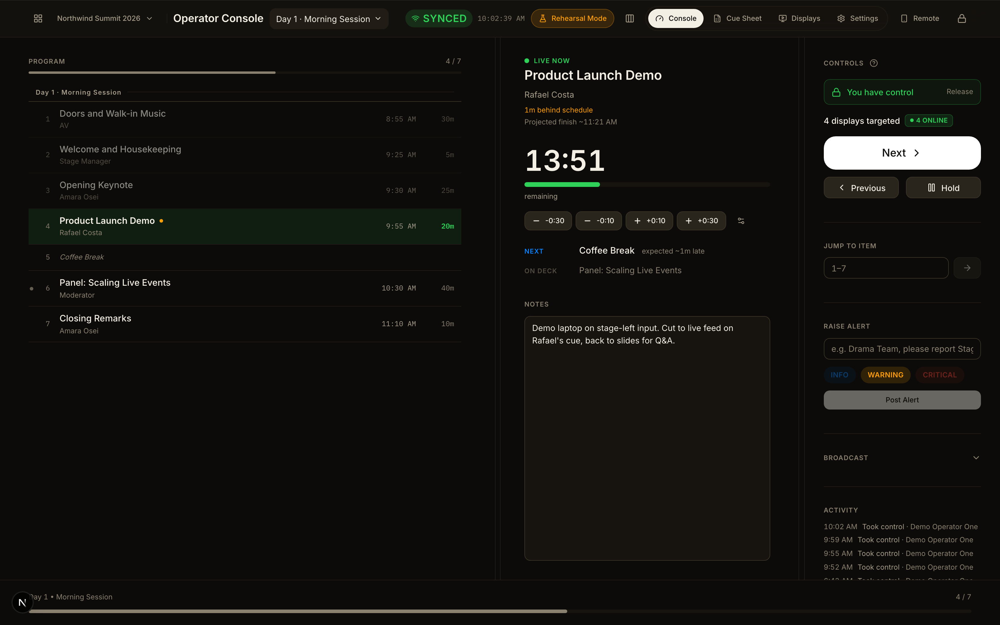
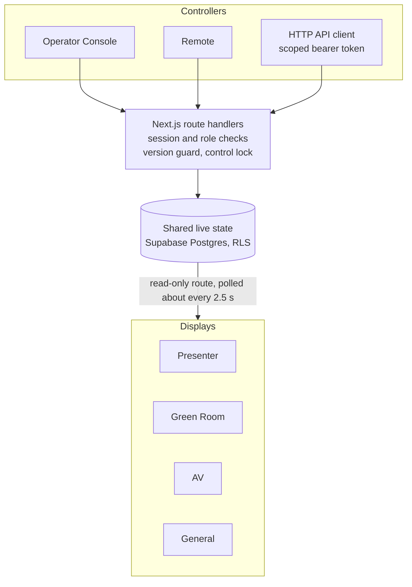

<div align="center">

# KramFlow

**A realtime operational system for live events that coordinates operators, presenters, AV teams, green rooms and live displays through shared operational state.**

[Live app](https://kramflow.me) · [Documentation](docs/) · [Issues](https://github.com/Workflow-bench/kramflow/issues)

[](https://github.com/Workflow-bench/kramflow/actions/workflows/ci.yml)


</div>

<p align="center"></p>

Live events often run on a spreadsheet that gets shouted across a green room. Each team keeps its own picture of what is happening now and what happens next, and the pictures drift apart.

KramFlow keeps one shared state for the show. The operator advances the program, and every connected surface shows the same current item, next item and countdown: the presenter's confidence monitor, the AV crew's prep list, the green room, the lobby screen.

**Scope.** KramFlow coordinates the operational layer around a show. It does not switch video, play media, run slides, sell tickets or handle registration. It is not a replacement for specialist production software such as Resolume, OBS, ATEM, QLab or ProPresenter, and it does not integrate with any of them today.

## Surfaces

Each surface is a separate layout built for how it is used: a phone in one hand, a console at arm's length, a TV read from across a room. They do not have identical capabilities.

**Operator side** (sign-in required). The event owner drives the live show. Editors can change the cue sheet. Viewers are read-only.

| Surface | Route | What it does |
|---|---|---|
| Dashboard | `/dashboard` | Your events: create, open, delete |
| Operator Console | `/e/[eventId]/operator` | Next, Previous, Hold, Jump, timer nudges, live notes and alerts. Shows schedule drift, projected finish and who holds control. |
| Remote | `/e/[eventId]/remote` | Phone controller: Next, Previous, Hold, Jump, timer nudges, alerts, notes and broadcasts, plus Mark Speaker Ready |
| Cue Sheet | `/e/[eventId]/operator/cue-sheet` | Drag-and-drop reorder, bulk edit, Excel import and export, print to PDF |
| Displays | `/e/[eventId]/displays` | Registry of connected screens with online status and latency, previews, Share Display links |
| Broadcast Center | `/e/[eventId]/broadcast` | Alerts, reminders and emergency overrides sent to displays |
| Rehearsal | `/e/[eventId]/rehearsal` | Local practice run. Nothing in it reaches a real display, share link or console. |
| Settings | `/e/[eventId]/settings` | Event details, auditoriums, collaborators, external API credentials |

**Display side** (no login when opened through a Share Display link)

| Display | Route | What it shows |
|---|---|---|
| General | `/general` | Lobby and public screens: current item, next, on deck, venue, active broadcasts |
| AV | `/av` | Current cue and countdown, the next cue, and its prep requirements from the cue sheet (mic, video, lighting and similar) |
| Green Room | `/green-room` | Performers: current item, countdown, operator notes, the next item to prepare, and whether the next speaker is marked ready |
| Presenter | `/presenter` | Confidence monitor: large countdown and progress, current and next item. Display modes include countdown, count-up and clock. It has no show controls; its only shortcut toggles fullscreen. |

## Phase 1 feature inventory

Phase 1 is a complete multi-tenant event operating system. It is built around a live-event trust boundary: an event owner, collaborators, share-link viewers, connected displays and integration clients can each do different things, and every route is scoped back to one event.

**Operator workspace**
- Supabase Auth signup, login, logout and confirmation resend.
- Database-backed login/signup rate limiting that survives restarts and serverless cold starts.
- Dashboard event list, event creation, event deletion, empty-state guidance and event launch points.
- Event shell that verifies owner or accepted collaborator access before rendering operator pages.

**Event management**
- Event details including name, date, venue, timezone and form configuration.
- Auditoriums scoped to an event and available to cue-sheet production fields.
- Collaborator invites by email with `viewer` and `editor` roles.
- Pending and accepted collaborator lists, with invite tokens hidden from non-owners.
- Signed-in invite acceptance so an invite token alone does not grant account access.
- Plan-limit enforcement for event creation.

**Cue sheet and program management**
- Excel cue-sheet import through the runtime upload route.
- Isomorphic cue-sheet parser shared by upload and seed scripts.
- Session, section/partition and program-row validation before commit.
- Program item create, edit and delete with validated cue fields, duration, status, color, auditorium, session and partition.
- Drag-and-drop reorder with database-side sort-order repair.
- Bulk field editing for selected cue-sheet items.
- Bulk moves to sections with event and partition ownership checks.
- Session create, rename, reorder and delete.
- Section start-time anchors and computed timing cascades.
- Cue-sheet export, print view and report-oriented pages.

**Live show control**
- Active session selection.
- Start, Next, Previous, Jump and Finish actions.
- Hold, pause and resume with elapsed-time correction.
- Manual timer correction with clamped future-start protection.
- Live alert set and dismiss.
- Per-program live note overrides that do not mutate source cue-sheet notes.
- Server-enforced sequencing lock with claim, renew, release, force and stale-claim expiry.
- Optimistic live-state version checks to avoid silent overwrite races.
- Activity logging for meaningful event operations.

**Remote and rehearsal**
- Mobile remote for backstage operation using the same live-action engine as the console.
- Rehearsal surface for local practice runs that do not reach production displays, share links or console state.
- Rehearsal reset without disturbing the real event run.

**Display engine**
- Display Manager registry with display names, types, rooms, online status, latency and profile assignment.
- Public display registration and heartbeat using a share-link token or an authorized operator preview.
- Owner-issued display commands such as reload, test-message and fullscreen-oriented commands.
- Display profiles for event-specific custom layouts.
- Custom display rendering through `/custom`.
- Time-sync endpoint for measuring display latency and clock offset.

**Public displays**
- Screens picker opened from a share link.
- General, AV, Green Room and Presenter display modes.
- Token or authenticated-session access for display preview.
- Event-scoped display polling for anonymous screens.
- Display-type hold and timer state keyed by `(event_id, display_type)`.
- Speaker-ready state for Green Room and display surfaces.

**Broadcast Center**
- Immediate broadcasts to all displays, a display type or a selected group.
- Scheduled broadcasts and due-time promotion.
- Broadcast dismiss and acknowledge flows from display clients.
- Broadcast history with severity, target and routing metadata.

**Share links and integrations**
- Expiring, revocable Share Display links backed by opaque random tokens.
- QR code display for fast TV setup.
- Last-used tracking for share-link activity.
- Per-event integration credentials with hashed token storage.
- Scoped HTTP API access for `state:read` and `live:control`.
- Integration actions run through the same live-action handler as the Operator Console and Remote.

**Security and reliability**
- Server-side authorization through session, role, share-token or integration-token checks before service-role database access.
- Multi-tenant isolation across events, collaborators, share links, sessions, partitions, programs, displays, broadcasts, profiles and integration credentials.
- Postgres Row Level Security as the browser/anon access backstop.
- Event-scoped resource checks for secondary IDs such as sessions, partitions and programs.
- Production-oriented dark UI with TV-readable typography, mobile-specific controls and dense desktop operator surfaces.

## AI features

Optional, and off unless `ANTHROPIC_API_KEY` is set. With no key the app behaves exactly as before and none of these buttons appear. In every case the AI proposes and a person confirms: it never changes the cue sheet, sends a broadcast, or touches the timer on its own.

| Feature | Where | What it does |
|---|---|---|
| Import from any document | Cue Sheet → Import → "Any document (AI)" | Reads a messy spreadsheet, CSV, text file or pasted text and proposes sessions, sections and items. You review and can remove rows before anything is saved. Like the Excel import, it replaces the affected sessions' items. |
| Readiness review | Operator Console → "AI review" (before a session goes live) | A second opinion on the stored cue sheet: back-to-back presenters, overlapping times, implied but unset AV needs, implausible durations. Advice only. |
| Alert and broadcast drafting | Console alert box and Broadcast Center → "Draft with AI" | Turns a rough note ("running 10 min late, tell green room") into a clear message with a suggested type, priority and audience. It only fills the form. |
| Post-show summary | Cue Sheet → Timing Report → "Write summary with AI" | Writes a short narrative from the figures the report already computes. The AI explains the numbers; it doesn't calculate them. |

Details worth knowing:

- **Data sent to Anthropic.** Uploaded or pasted document text for import; cue-sheet fields for the readiness review (presenter phone numbers are never sent, only whether one exists); the alert instruction plus the current and next item names for drafting; timing figures and item names for the summary.
- **Access.** Import needs editor access, alert drafting needs owner access (the same as sending), and the review and summary need viewer access. Every route re-checks the caller's role for that event.
- **Limits.** Per-user request throttling on every AI route, a 10 MB / 400,000-character cap on import documents, and validated structured output. Word and PDF aren't read directly yet; paste their text.
- **Cost.** Each use is a model call billed to your Anthropic account. A long cue-sheet import is the most expensive.

## Share Display and TV onboarding

A Share Display link opens the four displays on a TV or tablet without an account.

- **Secure link.** Each share is an opaque random token with an expiry the operator chooses (3, 7 or 30 days).
- **QR code.** Operators can copy the link or show a QR code that points to it.
- **TV code.** Each share also has a 6-digit code. On a TV, open `/tv`, enter the code, and pick a screen. Entry is rate limited per IP.
- **One code, many TVs.** Any number of TVs can use the active code. The code resolves to the same share, and the same access, as the link. It grants nothing extra.
- **Revocation and expiry.** Revoking a share, or letting it expire, stops the link, the QR code and the TV code together.

What a share can and cannot do:

- It can read the live state that displays render.
- It can register and heartbeat its own display, acknowledge broadcasts, and release scheduled broadcasts that are already due.
- It cannot change the timer, hold or speaker-ready state, and it cannot dismiss broadcasts. Those routes require a signed-in session with sufficient role.
- A signed-in operator session keeps the permissions of its role on the same displays.

## How it works



The queue is the product. Every surface is a different view of one live state.

- **Reference data** (sessions, sections, program items) is edited through the Cue Sheet or an Excel upload.
- **Live state** (active session, position, hold, alert, note overrides) is what changes during a show.
- **Operator surfaces** receive changes over Supabase Realtime.
- **Displays** poll a read-only route, because a share-link viewer has no user identity for Realtime to scope to.
- **Concurrent writes** are checked against a version number, and an optional control lock stops two tabs from driving the same show.

Deeper reading: [Architecture](docs/ARCHITECTURE.md), [Data model](docs/DATA_MODEL.md), [Display Engine](docs/DISPLAY_ENGINE.md).

## External HTTP API

A trusted client can call a small HTTP API with a bearer credential created in Settings. Each credential is scoped to one event and carries two scopes: `state:read` and `live:control`.

- `GET /api/v1/events/{eventId}/state` reads live state (`state:read`).
- `POST /api/v1/events/{eventId}/actions/{start|hold|resume|next}` drives the active session (`live:control`).

It goes through the same handler as the Console and Remote, so the control lock and version guard still apply, and each action is logged with the credential's name. Credentials can be revoked.

This is a plain HTTP API. There is no native Bitfocus Companion module, Stream Deck plugin, or integration with Resolume, OBS, ATEM, ProPresenter, vMix, QLab or NDI in this repository. Status codes and setup are in [docs/EXTERNAL_API.md](docs/EXTERNAL_API.md).

## Security

- Event data is isolated per event, enforced by Row Level Security policies in the database as well as in route handlers.
- Every mutating route re-verifies the session and the caller's role for that event on the server.
- Share Display access cannot change the timer, hold or speaker-ready state, and cannot dismiss broadcasts. Only signed-in sessions with sufficient role can.
- Share tokens and TV codes are generated with a cryptographically secure random source.
- TV code entry is rate limited per IP, and login and signup are throttled too.
- Revoked and expired shares are denied on every access method.

This project has not had a formal security audit or certification. See [Deployment](docs/DEPLOYMENT.md#authentication-model) for the full model.

## Quick start

Requires Node.js 20.9 or newer and a [Supabase](https://supabase.com) project.

```bash
git clone https://github.com/Workflow-bench/kramflow.git
cd kramflow
npm install
cp .env.example .env.local   # then add your Supabase values
npm run dev                  # http://localhost:3000
```

Set up the database first:

1. In the Supabase dashboard, enable Email under **Authentication → Providers**.
2. Run every file in [`supabase/migrations/`](supabase/migrations) in filename order, in the SQL Editor or with `supabase db push`. The first file is the base schema, and the migrations alone build the full schema. [`supabase/schema.sql`](supabase/schema.sql) is an older snapshot and is not needed. See [Deployment](docs/DEPLOYMENT.md#supabase-setup-required).
3. Copy the project URL, anon key and service-role key into `.env.local`.
4. Optional: `npm run seed` loads a sample cue sheet, or upload one from the app.

Then open `/signup`, create an account and create an event from the dashboard.

| Variable | Required | Purpose |
|---|---|---|
| `NEXT_PUBLIC_SUPABASE_URL` | Yes | Supabase project URL |
| `NEXT_PUBLIC_SUPABASE_ANON_KEY` | Yes | Anon key, restricted by Row Level Security |
| `SUPABASE_SERVICE_ROLE_KEY` | Yes | Server-only. Bypasses Row Level Security, so never expose it to the client. |
| `RESEND_API_KEY` | No | Sends collaborator invite emails |
| `RESEND_FROM_EMAIL` | No | Sender address on a domain verified in Resend |
| `ANTHROPIC_API_KEY` | No | Turns on the [AI features](#ai-features). Server-only. |
| `ANTHROPIC_MODEL_FAST` | No | Model for alert drafting. Defaults to `claude-haiku-4-5`, the cheapest. |
| `ANTHROPIC_MODEL_QUALITY` | No | Model for cue-sheet import, the readiness review and the post-show summary. Defaults to `claude-sonnet-5`. |

## Development

| Command | Purpose |
|---|---|
| `npm run dev` | Development server |
| `npm run build` · `npm start` | Production build and server |
| `npm run lint` | ESLint |
| `npm test` | Unit tests (Vitest) |
| `npm run test:e2e` | End-to-end test (Playwright, real dev server and Supabase project) |
| `npm run seed` | Load `data/cue-sheet.xlsx` into a fresh project |
| `npm run capture:product` | Regenerate the screenshots in `public/product/` |

Unit tests cover the cue-sheet parser, timing, validation, rate limiting, and share-link and TV-code access. GitHub Actions runs typecheck, lint, build, unit tests and the end-to-end test on every push and pull request (Dependabot pull requests skip the build and end-to-end steps). The end-to-end test needs a provisioned account: see [`e2e/README.md`](e2e/README.md).

Built with Next.js 16 (App Router), React 19, TypeScript, Tailwind CSS v4, Supabase (Postgres, Auth, Realtime), Framer Motion, dnd-kit, SheetJS and Resend, and deployed on Vercel.

## Documentation

| Doc | Read it when |
|---|---|
| [Architecture](docs/ARCHITECTURE.md), [Data model](docs/DATA_MODEL.md) | Changing the schema, sync or the cue-sheet parser |
| [Display Engine](docs/DISPLAY_ENGINE.md) | Working on displays, broadcasts or timers |
| [Design system](docs/DESIGN_SYSTEM.md), [Component guide](docs/COMPONENT_GUIDE.md) | Changing layout or adding components |
| [Deployment](docs/DEPLOYMENT.md) | Shipping to Vercel and Supabase |
| [External API](docs/EXTERNAL_API.md) | Calling the HTTP API |
| [Product requirements](docs/PRD.md), [Roadmap](docs/ROADMAP.md), [Changelog](docs/CHANGELOG.md) | Understanding scope and history |

## Current status

**Implemented**
- Multi-tenant events with Supabase Auth, and owner, editor and viewer roles
- Operator Console, Remote, Cue Sheet (Excel import and export), Broadcast Center, Display Manager and Rehearsal
- Presenter, Green Room, AV and General displays
- Share Display links, QR codes, 6-digit TV codes, revocation and expiry
- Scoped external HTTP API

**Verified**
- TypeScript typecheck, ESLint (warnings, no errors), Vitest unit tests and the production build
- GitHub Actions configuration that runs typecheck, lint, build, unit tests and the end-to-end test

**Exploring.** These are being evaluated. None is implemented or scheduled.
- Event visualization and event maps
- Integrations with production software
- Stream Deck and hardware control beyond the current HTTP API
- Show health and readiness
- Cue and run-of-show workflow improvements
- AI-assisted operations

**Not done yet.** Brand identity assets (logo, favicons, PWA icons). Earlier plans in [docs/ROADMAP.md](docs/ROADMAP.md) also list a performer phone companion, volunteer check-in, automatic cue timing and analytics.

## Contributing

Setup, checks and conventions are in [docs/CONTRIBUTING.md](docs/CONTRIBUTING.md).

## License

No open-source license has been selected yet.

## Background

KramFlow was developed from real live-event production workflows: multi-day, multi-session programs where operators, AV crew, performers and presenters each need a different view of the same run of show. The name comes from *krama* (क्रम): sequence, order, progression.
